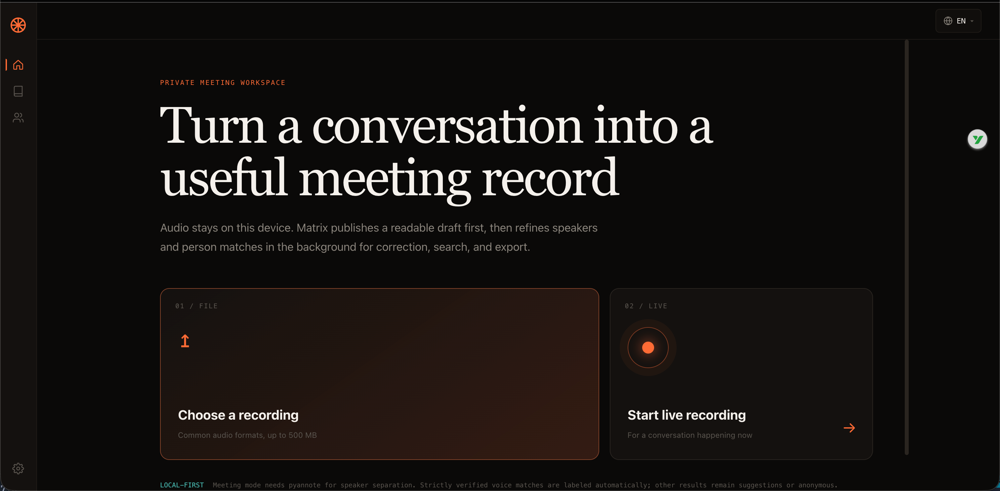
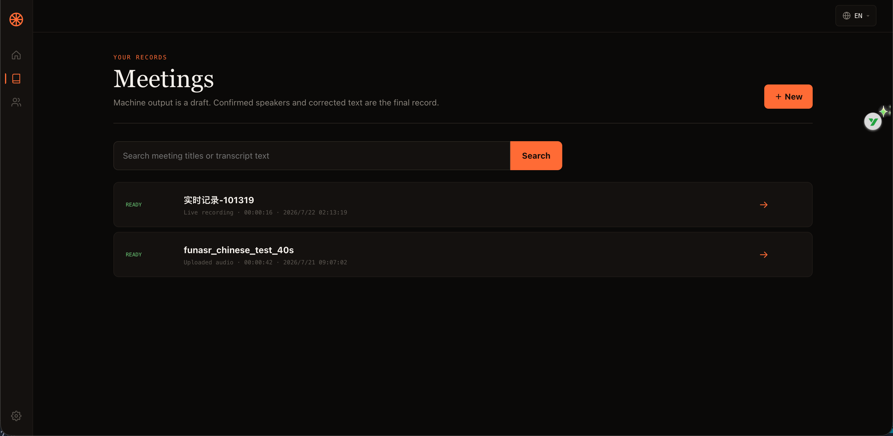
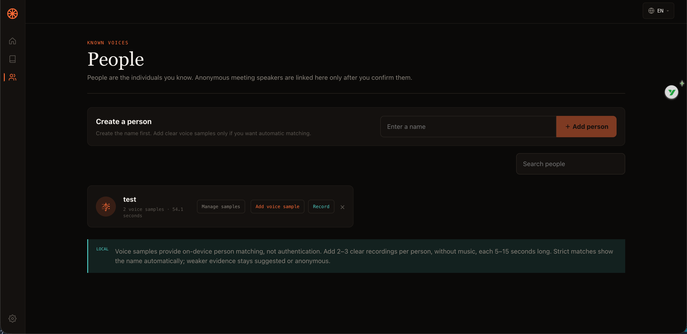

<div align="center">

# Matrix Live Diarizer

A local-first meeting transcription tool · no data egress by default · upload diarization + live captions + voice matching

[](LICENSE)
[](https://www.python.org/)
[](https://nodejs.org/)


[中文](README.md) · [Usage](docs/USAGE.md) · [LLM setup](docs/LLM_SETUP.md) · [Privacy](docs/PRIVACY.md) · [Security](docs/SECURITY.md) · [API](docs/API.md) · [Models](docs/MODELS.md)

</div>

> This is local-first software for a trusted single machine. It is suitable for local trial and iteration; it is **not** a public, multi-tenant, compliance-archive, or automatic identity-verification service.

## What it solves

Turn a meeting recording into a structured, speaker-attributed, correctable, exportable transcript — with **audio and transcripts never leaving your machine**. Online ASR services (Feishu, iFlytek, cloud ASR) all require uploading audio; this project does not. LLM summaries can run on local Ollama; a public LLM only receives transcript text when you explicitly allow it (never audio, never voiceprints).

Two paths in one tool, covering a meeting from live capture to post-meeting processing:

- 📤 **Upload a recording (post-meeting quality path)**: decode → ASR → optional pyannote multi-speaker diarization → voice-match enrolled people → store → correct / summarize / export.
- ⚡ **Live captions (during the meeting)**: browser mic → VAD segmenting → ASR → voice-identify enrolled people → stream segments as they are spoken and persist them.

## Core features

- 🖥️ **Local-first**: on-device inference by default; runs offline after the initial model download (when LLM is off).
- 👥 **Multi-speaker diarization**: upload/meeting mode uses pyannote community-1 to produce anonymous speaker turns.
- 🧬 **Voice matching**: map anonymous `Spk_01` to enrolled people under strict thresholds; always manually correctable, **not identity authentication**. Voice samples can be enrolled via **file upload or in-browser recording**.
- 📝 **Correctable minutes**: double-click to edit text, batch-reassign speakers, merge/split speakers, generate/edit summaries (LLM or local TextRank fallback).
- 📤 **Multi-format export**: Markdown / SRT / VTT / JSON.
- 🔧 **Swappable engines**: ASR (Qwen3-ASR / SenseVoice / Paraformer) and speaker (CamPlus / ERes2Net / Wespeaker) switchable at runtime.

## Product boundary

- Uploaded recordings drive post-meeting quality processing (diarization / minutes / export); live mode provides near-real-time captions during the meeting.
- Diarization creates anonymous speaker labels. Strict voice matches may display an enrolled person automatically, but this is not identity authentication and is always correctable.
- Without pyannote, transcription can finish but remains anonymous and reports diarization as unavailable.
- Data stays local by default and LLM features are off. Initial model downloads require network access.
- macOS MPS occasionally deadlocks; a load timeout (default 90s) falls back to CPU. The service is single-process (`WORKERS=1`) — do not raise it.
- Public hosting and regulated medical or legal workflows are outside the supported scope.

> **About the name**: live and upload are two entry points to the same meeting, both first-class. Multi-speaker diarization happens in upload mode; live mode identifies enrolled speakers via voiceprints and does not perform multi-speaker diarization.

## Screenshots

<div align="center">
  
  <p><b>Meeting workspace</b> · transcription, correction, speaker attribution, minutes, and export — all local</p>
</div>

<table>
  <tr>
    <td width="50%" align="center"><b>Live captions</b></td>
    <td width="50%" align="center"><b>Meetings library</b></td>
  </tr>
  <tr>
    <td></td>
    <td></td>
  </tr>
  <tr>
    <td width="50%" align="center"><b>People & voice samples (with in-browser recording)</b></td>
    <td width="50%" align="center"><b>Engines & settings</b></td>
  </tr>
  <tr>
    <td></td>
    <td></td>
  </tr>
</table>

## Core flow

**Upload a recording (post-meeting)**

1. Upload a recording and choose "quick transcript" or "meeting mode".
2. A background job decodes, transcribes, and optionally diarizes.
3. In the meeting detail, review auto-matches, confirm medium-confidence suggestions, and correct the text.
4. Generate or edit minutes, then export the formats you need.

**Live captions (during the meeting)**

1. Grant microphone access in the browser and start recording.
2. VAD auto-segments, ASR transcribes in real time, and enrolled speakers are voice-identified as they speak.
3. On stop, segments are persisted and enter the same correction / minutes / export flow as uploaded meetings.

## Quick start

Python 3.10–3.12, Node.js 20+, and FFmpeg are required. CI covers Python 3.10–3.12 on Ubuntu and Python 3.12 on macOS and Windows. The first start downloads ~1.8GB of models and may take tens of minutes depending on network speed; once downloaded, it can run permanently offline when LLM is off.

```bash
git clone https://github.com/lgy1027/matrix-live-diarizer.git
cd matrix-live-diarizer
python -m venv .venv
# Windows: .venv\Scripts\activate
# macOS/Linux: source .venv/bin/activate
pip install -r requirements.txt
cd web && npm ci && npm run build && cd ..
python main.py
```

Open `http://127.0.0.1:8000`. The default server binds only to loopback. Default account is `admin/admin`; the first login forces a password change.

Interfaces are still iterating; do not use this project as the only copy or as a long-term archive.

Docker (CPU only):

```bash
docker compose up --build
```

CUDA users should use a local Python environment and follow PyTorch's official install instructions for the matching version (the Docker image is CPU only). Multi-architecture images require maintainers to run `docker buildx build --platform linux/amd64,linux/arm64` and verify each target; no prebuilt images are promised.

## Optional configuration

Copy `.env.example` to `.env`. Most local single-machine setups need no changes. Common keys:

```dotenv
HOST=127.0.0.1
ASR_DEVICE=auto
ASR_ENGINE=qwen3
SPEAKER_ENGINE=campplus
HF_TOKEN=
LLM_ENABLED=false
```

`ASR_ENGINE` can be `qwen3` / `sensevoice` / `paraformer` / `paraformer_streaming`; `SPEAKER_ENGINE` can be `campplus` / `eres2net` / `wespeaker`. See `.env.example` for the rest. To enable LLM features (summary / action items / minutes), see the [LLM setup guide](docs/LLM_SETUP.md).

**When `HF_TOKEN` is needed** (leave empty otherwise):

- ✅ You want **multi-speaker diarization** in uploaded meetings (pyannote community-1, a gated model) → required, and you must accept the terms on the HF model page.
- ✅ You enable **word-level timestamps** (Qwen3-ForcedAligner) → recommended to avoid HF rate limits.
- ❌ Only live captions / quick transcript / local voice matching → **not needed**.

Use `HOST=0.0.0.0` and `DEPLOYMENT_MODE=lan` only when explicitly deploying to a LAN, and pair them with a strong random `JWT_SECRET` and trusted `ALLOWED_ORIGINS`. Cross-machine access also requires HTTPS (see "Cross-machine access" below).

## Cross-machine access (optional)

The default `HOST=127.0.0.1` listens only on localhost — use `http://127.0.0.1:8000` locally; microphone and upload work normally.

To access from **another machine** (uploading recordings and in-browser recording both need the mic), HTTPS is required: browsers disable `getUserMedia` on `http://IP` non-localhost origins. The server can run HTTPS directly with a self-signed certificate. Install OpenSSL first, then use the cross-platform Python script to include the host's IPv4 addresses in the certificate.

macOS / Linux:

```bash
python3 scripts/gen_self_cert.py
ENABLE_HTTPS=1 HOST=0.0.0.0 \
DEPLOYMENT_MODE=lan ALLOWED_ORIGINS=https://<host-IP>:8000 \
python main.py
```

Windows PowerShell:

```powershell
python .\scripts\gen_self_cert.py
$env:ENABLE_HTTPS = "1"
$env:HOST = "0.0.0.0"
$env:DEPLOYMENT_MODE = "lan"
$env:ALLOWED_ORIGINS = "https://<host-IP>:8000"
python main.py
```

The backward-compatible `bash scripts/gen_self_cert.sh` entry point remains available on macOS and Linux.

Open `https://<host-IP>:8000`; accept the "not secure" warning on first visit.

## Data and network

- Meeting audio: `data/media/` (uploaded originals, named by meeting id)
- Person voice-sample audio: `data/media/voices/<person_id>/`
- Transcripts, people, voice embeddings, settings, and an optional LLM API key: `data/matrix.db`
- Model cache: project-root `models/` by default (overridable via `MODELS_DIR`)
- Optional public LLM: only sends transcript text when the user explicitly allows it

This data is not encrypted at the application level; use OS-level disk encryption and protect the local account. Deleting a meeting or person removes the managed audio files; stop the service before deleting the entire `data/` directory.

## Development verification

```bash
pytest -q --ignore=tests/test_smoke_boot.py
```

```bash
cd web
npm run check:i18n
npm run typecheck
npm run build
npm audit --omit=dev --audit-level=high
```

A real-model smoke test downloads and loads large models, so it is not run in normal CI: `MATRIX_TEST_REAL_DEPENDENCIES=1 pytest tests/test_smoke_boot.py -v`. On PowerShell run `$env:MATRIX_TEST_REAL_DEPENDENCIES="1"` first.

## Contributing

Pull requests are welcome; see [CONTRIBUTING.md](CONTRIBUTING.md) for the workflow and conventions.

## Reporting issues

- Bugs and feature requests: open a [GitHub Issue](https://github.com/lgy1027/matrix-live-diarizer/issues).
- Security vulnerabilities: follow [SECURITY.md](SECURITY.md) to report privately; do not attach recordings, transcripts, or credentials to issues.

## License

Project code is under the [MIT License](LICENSE). Model weights keep their upstream licenses and terms; MIT does not relicense them. See [docs/MODELS.md](docs/MODELS.md) and verify upstream terms before deployment.
