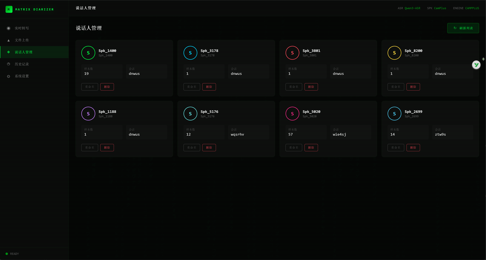
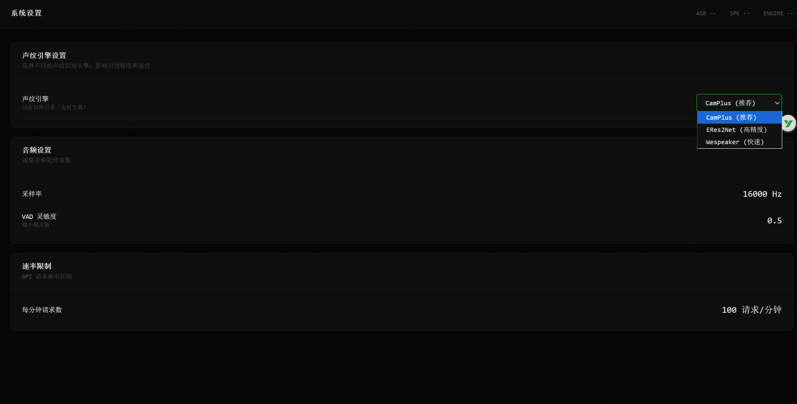

<div align="center">

# Matrix Live Diarizer

**实时语音转写与说话人识别系统**

基于 Qwen3-ASR 构建，支持 WebSocket 流式传输与多声纹引擎切换

[](https://www.python.org/downloads/)
[](LICENSE)
[](https://modelscope.cn/models/Qwen/Qwen3-ASR-0.6B)

[English](#english) | 简体中文

</div>

---

## ✨ 特性

- 🎤 **实时转写** - WebSocket 流式传输，说话即转写，低延迟响应
- 👥 **说话人识别** - 自动区分不同说话人，支持增量学习
- 🔧 **多引擎支持** - CamPlus / ERes2NetV2 / Wespeaker 三种声纹引擎可切换
- ⚡ **运行时切换** - 支持 API 动态切换声纹引擎，无需重启服务
- 📁 **离线处理** - 支持上传音频文件批量处理，自动分段识别
- 🎯 **智能 VAD** - Silero VAD 语音活动检测，精准识别语音段
- 🧹 **幻觉过滤** - 自动过滤 ASR 常见幻觉输出，提升准确性
- 🔐 **速率限制** - 内置请求速率限制，防止滥用
- 🏥 **健康检查** - 提供存活与就绪检查端点，支持容器编排

## 🚀 快速开始

### 环境要求

- Python 3.12+
- PyTorch 2.0+ (支持 CUDA / MPS / CPU)

### 安装

```bash
# 克隆项目
git clone https://github.com/lgy1027/matrix-live-diarizer.git
cd matrix-live-diarizer

# 安装依赖
pip install -r requirements.txt
```

### 启动服务

```bash
# 默认使用 CamPlus 引擎
python main.py

# 使用 ERes2NetV2 高精度引擎 (Linux/macOS)
SPEAKER_ENGINE=eres2net python main.py

# 使用 ERes2NetV2 高精度引擎 (Windows PowerShell)
$env:SPEAKER_ENGINE="eres2net"; python main.py

# 使用 Wespeaker 引擎
$env:SPEAKER_ENGINE="wespeaker"; python main.py
```

服务启动后：
1. 用浏览器打开 `web/index.html` 文件
2. 页面会自动连接到后端服务

<details>
<summary>📊 查看启动日志示例</summary>

```
[FACTORY] 使用 CamPlus 引擎
[ASR] 初始化中，设备: mps
[ASR] 模型加载成功（VAD 已启用）
[CamPlus] 引擎初始化完成
声纹引擎: CamPlus, 模型: damo/speech_campplus_sv_zh-cn_16k-common
INFO:     Uvicorn running on http://0.0.0.0:8000
```

</details>

## 📖 使用指南

### Web 界面

1. 启动后端服务：`python main.py`
2. 用浏览器打开 `web/index.html` 文件
3. 点击 **Start Stream** 开始实时转写
4. 点击 **Upload File** 上传音频文件处理

> 💡 **提示**：Web 界面会自动连接到 `127.0.0.1:8000` 的后端服务






### API 接口

#### WebSocket 实时流

```
ws://127.0.0.1:8000/ws/v1/stream/{client_id}
```

**输入**: PCM Int16 字节流 (16kHz)

**输出**:
```json
{
  "speaker": "Spk_1234",
  "text": "增量文本",
  "time": "14:30:25"
}
```

#### 文件上传

```bash
curl -X POST "http://127.0.0.1:8000/v1/upload" \
  -H "Content-Type: multipart/form-data" \
  -F "file=@audio.wav"
```

**响应**:
```json
{
  "status": "success",
  "filename": "audio.wav",
  "speakers": ["Spk_001", "Spk_002"],
  "segments": [
    {"speaker": "Spk_001", "text": "你好", "start_time": 0.0, "end_time": 1.5}
  ]
}
```

#### 获取模型信息

```bash
curl http://127.0.0.1:8000/v1/models
```

#### 健康检查

```bash
# 存活检查
curl http://127.0.0.1:8000/health

# 就绪检查
curl http://127.0.0.1:8000/ready
```

#### 说话人管理

```bash
# 获取说话人列表
curl "http://127.0.0.1:8000/v1/speakers"
curl "http://127.0.0.1:8000/v1/speakers?session_id=session_a"

# 获取单个说话人
curl http://127.0.0.1:8000/v1/speakers/Spk_001

# 重命名说话人
curl -X PATCH http://127.0.0.1:8000/v1/speakers/Spk_001 \
  -H "Content-Type: application/json" \
  -d '{"name": "张三"}'

# 删除说话人
curl -X DELETE http://127.0.0.1:8000/v1/speakers/Spk_001
```

#### 引擎管理

```bash
# 获取所有引擎信息
curl http://127.0.0.1:8000/v1/engines

# 切换声纹引擎（运行时切换）
curl -X PUT http://127.0.0.1:8000/v1/engine \
  -H "Content-Type: application/json" \
  -d '{"engine_type": "eres2net"}'
```

<details>
<summary>🔧 更多配置选项</summary>

**服务器配置**

| 参数 | 默认值 | 环境变量 | 说明 |
|------|--------|----------|------|
| host | 0.0.0.0 | HOST | 监听地址 |
| port | 8000 | PORT | 监听端口 |
| workers | 1 | WORKERS | 工作进程数 |
| debug | false | DEBUG | 调试模式 |

**音频处理配置**

| 参数 | 默认值 | 环境变量 | 说明 |
|------|--------|----------|------|
| sample_rate | 16000 | AUDIO_SAMPLE_RATE | 采样率 |
| buffer_threshold | 32000 | AUDIO_BUFFER_THRESHOLD | 音频缓冲阈值（采样点） |
| silence_threshold | 0.008 | AUDIO_SILENCE_THRESHOLD | 静音检测阈值 |
| timeout_seconds | 30.0 | AUDIO_TIMEOUT_SECONDS | 无音频超时断开 |
| max_buffer_seconds | 10 | AUDIO_MAX_BUFFER_SECONDS | 缓冲区上限（秒） |
| max_segment_seconds | 5 | AUDIO_MAX_SEGMENT_SECONDS | 单语音段最大长度（秒） |

**VAD 配置**

| 参数 | 默认值 | 环境变量 | 说明 |
|------|--------|----------|------|
| vad_threshold | 0.5 | VAD_THRESHOLD | VAD 灵敏度 |
| min_speech_duration_ms | 200 | VAD_MIN_SPEECH_DURATION | 最小语音时长 |

**速率限制配置**

| 参数 | 默认值 | 环境变量 | 说明 |
|------|--------|----------|------|
| rate_limit_enabled | true | RATE_LIMIT_ENABLED | 是否启用速率限制 |
| requests_per_minute | 60 | RATE_LIMIT_REQUESTS_PER_MINUTE | 每分钟请求数 |
| requests_per_hour | 1000 | RATE_LIMIT_REQUESTS_PER_HOUR | 每小时请求数 |

**声纹引擎配置**

| 参数 | 默认值 | 环境变量 | 说明 |
|------|--------|----------|------|
| speaker_engine | campplus | SPEAKER_ENGINE | 声纹引擎类型 |

</details>

## 🏗️ 项目结构

```
matrix-live-diarizer/
├── main.py                     # 应用入口
├── app/                        # FastAPI 应用层
│   ├── api/
│   │   ├── websocket.py        # WebSocket 实时流接口
│   │   ├── upload.py           # 文件上传接口
│   │   ├── speakers.py         # 说话人管理接口
│   │   └── health.py           # 健康检查接口
│   ├── middleware/
│   │   └── rate_limit.py       # 速率限制中间件
│   ├── schemas/
│   │   └── response.py         # Pydantic 响应模型
│   ├── services/
│   │   └── session.py          # 会话上下文管理
│   ├── config.py               # 配置管理
│   └── constants.py            # 常量定义
├── engine/                     # 推理引擎层
│   ├── asr_engine.py           # ASR 引擎 (Qwen3-ASR)
│   └── speaker/                # 声纹引擎模块
│       ├── speaker_factory.py  # 引擎工厂与管理器
│       ├── base_engine.py      # 引擎基类
│       ├── campplus_engine.py  # CamPlus 引擎
│       ├── eres2net_engine.py  # ERes2NetV2 引擎
│       └── wespeaker_engine.py # Wespeaker 引擎
├── tests/                      # 测试用例
└── web/
    └── index.html              # Web 前端界面
```

## 🎯 声纹引擎对比

| 引擎 | EER (VoxCeleb) | EER (CNCeleb) | 参数量 | 速度 | 适用场景 |
|:----:|:--------------:|:-------------:|:------:|:----:|:--------:|
| **CamPlus** | 0.65% | 6.78% | 7.2M | ⚡ 快 | 实时场景 (默认) |
| **ERes2NetV2** | 0.61% | 6.14% | 17.8M | 🚗 中 | 高精度需求 |
| **Wespeaker** | 1.05% | 6.92% | 6.34M | ⚡ 快 | 经典稳定 |

## 🧠 技术架构

```
┌─────────────────────────────────────────────────────────────┐
│                        Client Layer                          │
│  ┌─────────────┐  ┌─────────────┐  ┌─────────────────────┐  │
│  │  WebSocket  │  │  REST API   │  │    Web Interface    │  │
│  └──────┬──────┘  └──────┬──────┘  └──────────┬──────────┘  │
└─────────┼────────────────┼───────────────────┼──────────────┘
          │                │                   │
          ▼                ▼                   ▼
┌─────────────────────────────────────────────────────────────┐
│                      FastAPI Application                     │
│  ┌──────────────────────────────────────────────────────┐   │
│  │                  Session Manager                       │   │
│  │         (Audio Buffer / Incremental Text)             │   │
│  └──────────────────────────────────────────────────────┘   │
└─────────────────────────────┬───────────────────────────────┘
                              │
                              ▼
┌─────────────────────────────────────────────────────────────┐
│                       Engine Layer                           │
│  ┌─────────────────────┐    ┌─────────────────────────────┐ │
│  │     ASR Engine      │    │      Speaker Engine         │ │
│  │   (Qwen3-ASR)       │    │  ┌─────┬─────┬─────────┐   │ │
│  │  - VAD Detection    │    │  │Camp+│ERes2│Wespeaker│   │ │
│  │  - Preprocessing    │    │  └─────┴─────┴─────────┘   │ │
│  │  - Hallucination    │    │  - ChromaDB Storage        │ │
│  └─────────────────────┘    │  - Incremental Learning    │ │
│                              └─────────────────────────────┘ │
└─────────────────────────────────────────────────────────────┘
```

## 📦 模型来源

| 模块 | 模型 | 来源 |
|------|------|------|
| ASR | [Qwen3-ASR-0.6B](https://modelscope.cn/models/Qwen/Qwen3-ASR-0.6B) | ModelScope |
| Speaker | [CamPlus](https://modelscope.cn/models/damo/speech_campplus_sv_zh-cn_16k-common) | ModelScope |
| Speaker | [ERes2NetV2](https://modelscope.cn/models/iic/speech_eres2netv2_sv_zh-cn_16k-common) | ModelScope |
| Speaker | [Wespeaker](https://modelscope.cn/models/iic/speech_resnet34_sv_zh-cn_3dspeaker_16k) | ModelScope |
| VAD | [Silero VAD](https://github.com/snakers4/silero-vad) | torch.hub |

## ⚠️ 注意事项

- **单进程运行**: Mac MPS 需单进程，避免内存溢出
- **采样率**: 音频输入必须是 16kHz
- **首次启动**: 模型会自动下载到本地缓存，请确保网络畅通

## 🤝 贡献

欢迎提交 Issue 和 Pull Request！

1. Fork 本仓库
2. 创建特性分支 (`git checkout -b feature/AmazingFeature`)
3. 提交更改 (`git commit -m 'Add some AmazingFeature'`)
4. 推送到分支 (`git push origin feature/AmazingFeature`)
5. 提交 Pull Request

## 📄 License

本项目基于 [MIT License](LICENSE) 开源。

---

<div align="center">

**如果这个项目对你有帮助，请给一个 ⭐ Star 支持一下！**

</div>

## v0.2 新功能 (2026-06)

- **转写历史**：所有会话自动存档，可在 `web/history.html` 浏览
- **4 种导出格式**：SRT 字幕、WebVTT、Markdown、JSON
- **统计**：说话人时长占比、字数、hot words、静默比
- **可选 LLM 插件**：本地 LLM 可生成摘要、提取行动项、生成纪要
- **多页前端**：实时、历史、详情、设置四页

详细设计见 `docs/superpowers/specs/2026-06-06-产出型生产力工具设计.md`。

## 隐私

本项目承诺：你的音频、文本、声纹向量、设置**永远不离开你的电脑**。
详见 [`docs/PRIVACY.md`](docs/PRIVACY.md)。

## 本地 LLM 集成

可选的 LLM 功能（摘要、行动项、会议纪要）需要本地 LLM 服务。
详见 [`docs/LLM_SETUP.md`](docs/LLM_SETUP.md)。