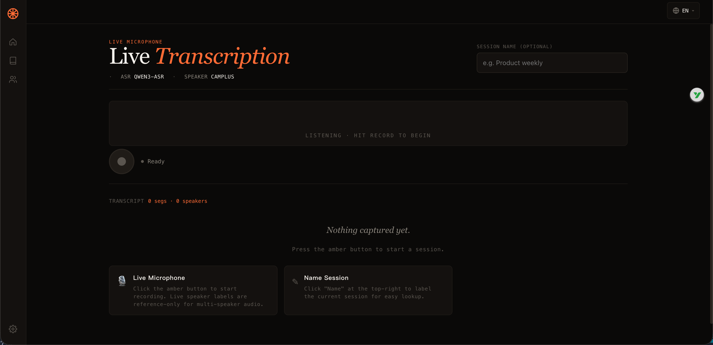
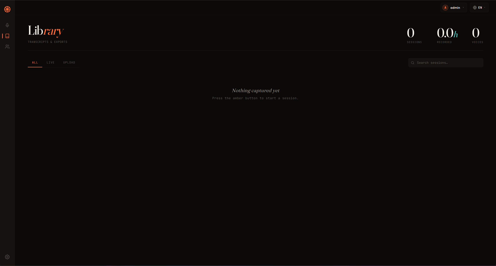
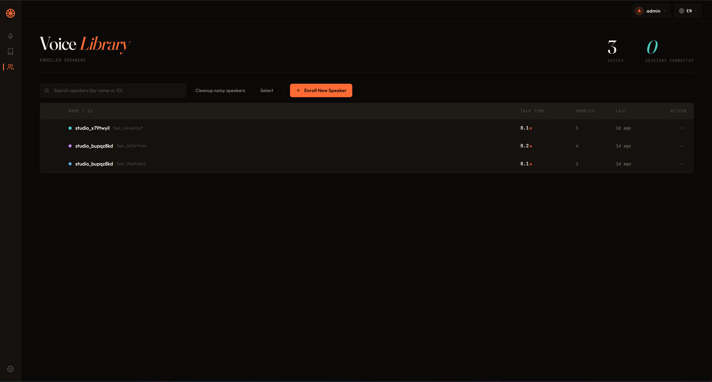
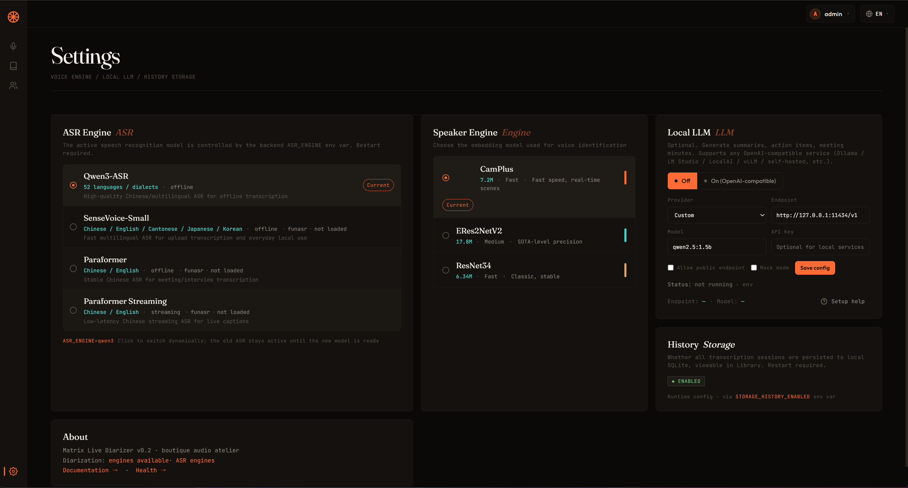

# 使用指南

本文档是详细使用教程（Web 界面 + 高级场景）。
**30 秒快速上手**请看 [README](../README.md)；**API 接口**请看 [API.md](API.md)。

---

## 1. Web 界面 5 步走

1. 启动后端：`python main.py`（等 `[ASR] 模型加载成功` 日志出现）
   - Mac M 系列卡住超过 90s：`ASR_DEVICE=cpu python main.py`
2. 浏览器打开 `http://127.0.0.1:8000/`（生产模式下 FastAPI 托管 `web/dist`）
3. 页面会自动连接同源后端的 REST API 和 WebSocket
4. 左侧 4 个标签：**Live**（实时） / **Library**（历史） / **Voice**（声纹库） / **Settings**（设置）
5. 默认语言为 **中文**（右上角切 EN）

> 开发前端时可以单独运行 `cd web && npm run dev`，再通过 `web/.env.local` 指向后端端口。

## 2. 实时转写（Live）

1. 点中间 **录音按钮**（琥珀色圆形）→ 浏览器弹麦克风权限 → 同意
2. 说话 → 转写实时显示在 Transcript 区域
3. 多人说话 → 顶部 `[Spk_xxx]` 标签自动切换（实时多人标签仅作参考）
4. 再点一次录音按钮结束 → 会话自动存档到 Library

### 实时流配置

- 默认采样率 16kHz（浏览器自动降采样）
- 静音超过 3 秒自动结束识别
- 单段最大 5 秒强制识别（避免长段延迟）





### 实时转写 — 说话人操作

录制时，前端做了 4 项体验优化让长会话更可读：

#### 1. 转写中占位符

你开口后立刻显示脉动点 `▌ 正在识别…`（对应服务端 VAD 检测到语音的第一帧），ASR 出结果后该占位行替换为打字机效果的真实文字。直观感受：从「沉默几秒 → 突然出字」变成「立刻有反馈 → 渐进呈现」。

#### 2. Speaker 友好名

后端返回的 `Spk_a3f9e2` 这种系统 ID 在前端显示为 `Speaker 1`、`Speaker 2`、`Speaker 3`，按当前会话首次出现顺序分配。同一个声音在当前会话内始终映射到同一个编号，刷新页面重置。

#### 3. 置信度可视化

声纹识别相似度按 3 档可视化：

| 视觉 | 含义 | 阈值 |
|---|---|---|
| 实线 `Speaker 1` | 高置信度，识别可靠 | score ≥ 0.65 |
| 虚线 `Speaker 2?` | 中等，标签可能错 | 0.40 ≤ score < 0.65 |
| 灰底 `未知说话人` | 低，几乎不可信 | score < 0.40 |

看到虚线 / 灰色时优先核实说话人是否正确。

#### 4. 一键改名 / 合并

点 segment 左侧说话人标签 → 弹菜单：

- **改成当前会话名字**：输入框 → 输入（如 `Alice`）→ 当前会话内该段及同 ID 联动显示新名字（刷新页面重置）
- **合并到已有 Speaker 1/2/3**：把当前段合并到 session 内已出现的某说话人
- **保存为新声纹**：把当前段声音注册到声纹库（后续自动识别）— 走 enroll 流程
- **恢复原始 ID**：撤销当前会话改名

> 提示：虚线标签（置信度中等）优先核实；改名仅 session 内生效，要永久生效请用「保存为新声纹」。

#### 说话人识别准确度 — 场景决定一切

实时模式说话人识别有**结构性限制**，不同场景准确度差异巨大：

| 场景 | 准确度 | 怎么做 |
|---|---|---|
| **单人独白**（网课/播客/直播字幕） | **95%+** | 开箱即用 |
| **2-3 人小会议** | 60-80% | 给每人手动 enroll |
| **3-10 人会议（单麦克风）** | 40-60% | 仅作参考性字幕 |
| **3-10 人会议（多麦克风 + enroll）** | 85%+ | 每人一麦 |
| **3-10 人会议（离线高准确度）** | 80%+ DER | 上传文件 + `?diarization=pyannote` |

**单麦克风多人会议的硬限制**：算法无法在单声道音频里做声源分离（除非有硬件麦克风阵列或接触式麦克风）。多人说话时声音叠加，cosine 距离波动 0.3-0.6，>0.5 误判严重。

**想要多人精确区分？** 两条路：
1. **多麦克风**：每人一麦 + 每人都 enroll 自己的声纹
2. **离线模式**：上传完整录音文件，启用 pyannote 3.1 离线 diarization（业界 SOTA，Diarization Error Rate ~18%）

> ASR 只负责转文字。实时说话人标签来自 CamPlus / ERes2NetV2 / Wespeaker 声纹引擎；上传离线高准确度 diarization 来自 pyannote。切换 Qwen3 / Paraformer / SenseVoice 不会让 ASR 模型本身具备说话人识别能力。

详见 **[SPEAKER_DIARIZATION.md](SPEAKER_DIARIZATION.md)** 完整文档。

## 3. 文件上传

上传模式和实时模式的目标不同：实时模式优先低延迟,上传模式拿到完整文件后可以做更稳的分段、合并和离线 diarization。需要多人会议归档时,优先上传完整录音并启用 pyannote。

### 方式 A：Live 页右侧 "Quick Capture"

适合**临时单文件**：
1. 在 Live 页面右侧 "Quick Capture" 区域
2. 拖拽文件到 dropzone，或点击选择文件
3. 自动开始上传 + 处理
4. 完成后跳到 Library 详情页

### 方式 B：curl / API

适合**批量或脚本**：

```bash
# 启用说话人识别（默认）
curl -X POST "http://127.0.0.1:8000/v1/upload" \
  -F "file=@meeting.mp3"

# 关闭说话人识别（更快，纯转写）
curl -X POST "http://127.0.0.1:8000/v1/upload?enable_diarization=false" \
  -F "file=@lecture.mp3"
```

### 长音频自动分段

> 30 秒以上的音频自动按 30s + 1s 重叠分段处理。
> 相邻段的重叠文本自动合并去重。

## 4. 历史浏览（Library）

1. 左侧切到 **Library** 标签
2. 顶部统计：sessions 数 / 总时长 / voices 数
3. 搜索框支持按标题 / 文件名模糊搜索
4. 标签页：**All** / **Live** / **Upload** 过滤来源
5. 点击某条记录 → 进入详情页

### 详情页操作

- 全文转写（按说话人分组）
- 4 种导出：SRT 字幕 / WebVTT / Markdown / JSON
- 删除 / 重命名会话
- LLM 一键生成摘要 / 行动项 / 纪要（需先在 Settings 启用 LLM）



## 5. 声纹库（Voice Library）

所有识别过的说话人都列在这里。

### 单个管理

点卡片右上角 **⋮** 菜单：
- **Rename** — 弹 Modal 输入新名字
- **Delete** — 弹确认后删除（同时清空 segments 引用）

### 批量选择（v0.2.1+）

1. 顶部点 **Select** 按钮 → 进入选择模式
2. 卡片左上角 checkmark 渐入
3. 点多个卡片 toggle 选中 / 取消
4. 顶部 toolbar：
   - **Select all** / **Deselect all** 切换
   - **Delete N** — 弹危险确认 → 真删（dry_run 预览影响范围）
   - **Cancel** / **ESC** — 退出选择模式

### 引擎切换（Settings）

点右上角齿轮 → **Speaker Engine** 区块：
- 列出 3 个引擎（CamPlus / ERes2NetV2 / Wespeaker）
- 点 "Activate" 运行时切换
- ⚠️ 切换后 `embedding_dim` 变化时（CamPlus 192 ↔ Wespeaker 256）会提示
  声纹数据不兼容，需要重新注册说话人



## 6. 高级场景

### 6.1 多人会议（会议场景）

- 会议时长建议 ≤ 1 小时（上传处理上限）
- 上传时 `enable_diarization=true`（默认）
- 选 **CamPlus** 引擎（实时优先）
- 结束后用 Library 详情页生成 LLM 摘要

### 6.2 批量处理（演讲场景）

- 关闭说话人识别 `enable_diarization=false`（更准更快）
- 多个文件循环调用 `/v1/upload`
- 用 `/v1/history` API 列出所有会话

### 6.3 本地 LLM 增强

详见 [LLM_SETUP.md](LLM_SETUP.md)。推荐：
- 本地：Ollama + qwen2.5:1.5b（3GB 内存）
- 远程：OpenAI-compatible provider（需用户显式配置 endpoint、API key 和公网访问开关）

### 6.4 容器化部署

```bash
# 反向代理示例（nginx）
location / {
    proxy_pass http://127.0.0.1:8000;
    proxy_set_header X-Forwarded-For $proxy_add_x_forwarded_for;
}

# ⚠️ 必须配置 trusted_proxies,否则限流失效
# .env 改成包含 nginx IP
```

## 7. 数据管理

### 查看数据

```bash
# SQLite 转写 + 设置
sqlite3 data/matrix.db ".tables"
sqlite3 data/matrix.db "SELECT id, title, source FROM sessions LIMIT 10;"

# ChromaDB 声纹
ls -la engine/speaker/speaker_db/campplus/
```

### 删除数据

```bash
# 全部清除(下次启动重建)
rm -rf data/ engine/speaker/speaker_db/ uploads/

# 详细隐私说明
# https://github.com/lgy1027/matrix-live-diarizer/blob/main/docs/PRIVACY.md
```

### 备份

```bash
# 转写 + 设置
cp data/matrix.db backup-$(date +%Y%m%d).db

# 声纹(整个目录)
tar -czf speaker_db-$(date +%Y%m%d).tar.gz engine/speaker/speaker_db/
```

## 8. 故障排查速查

| 现象 | 原因 | 解决 |
|------|------|------|
| 启动卡 4+ 分钟 0% CPU | macOS MPS 加载死锁 | `ASR_DEVICE=cpu python main.py` |
| 上传无反应 | 浏览器文件选择事件未触发 | 刷新页面后重新选择文件 |
| 同文件多次识别为不同人 | 样本过短、噪声大或声纹库样本不足 | 使用更清晰的 5-30 秒样本注册声纹 |
| 实时连接断开 | mic 权限 / 网络 | 检查浏览器控制台 |
| LLM 显示不可用 | Ollama 未起 / endpoint 错 | `curl $LLM_ENDPOINT/models` |
| 浏览器 `WebSocket error` | 后端没启 / 端口错 | 看 README 启动日志 |

更多问题见 [README FAQ](../README.md#-常见问题) 和 [LLM_SETUP.md 故障排查](LLM_SETUP.md#故障排查)。
